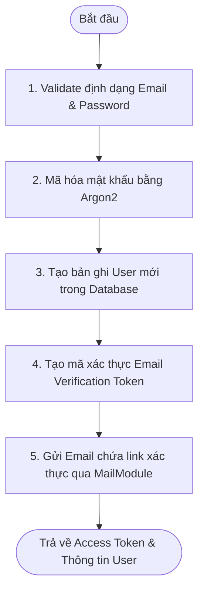
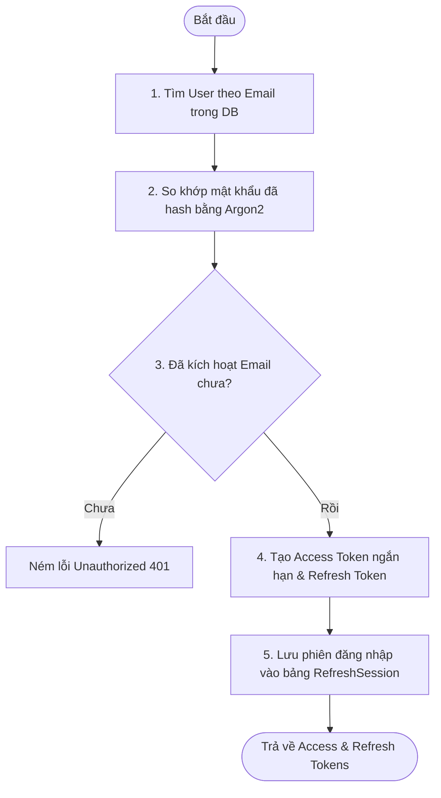
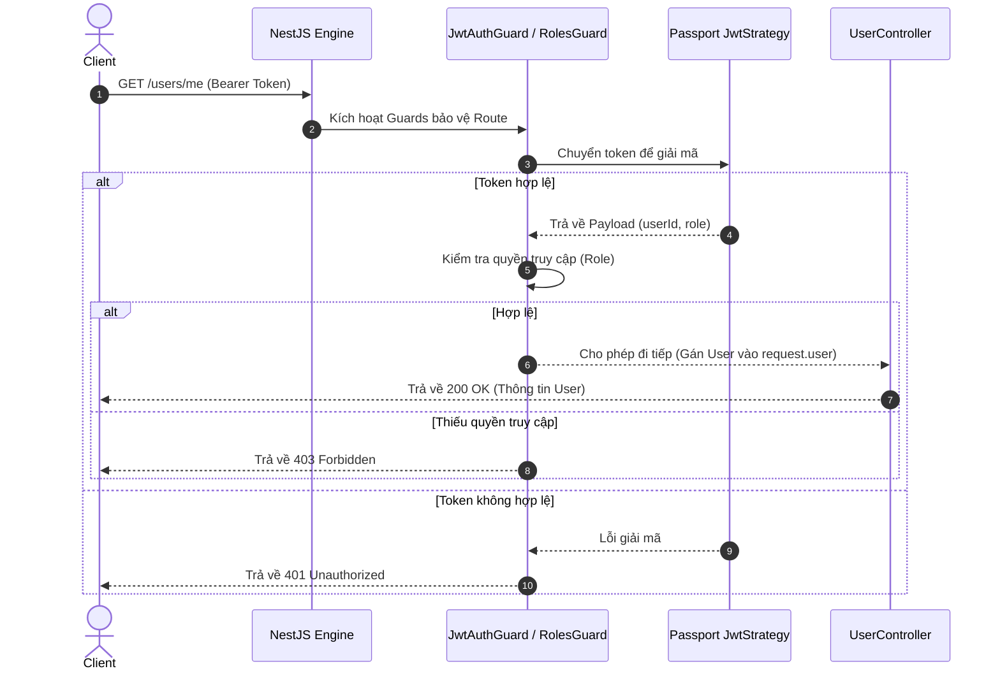

# Tài Liệu Đặc Tả Thiết Kế: User & Authentication Modules

Tài liệu này đặc tả chi tiết về cấu trúc thư mục, chức năng, danh sách API, luồng xử lý (flows), các bộ bảo vệ (guards), bộ lọc (filters) và kiểm thử cho hai Module cốt lõi: **User** và **Authentication**.

---

## 1. User Module

Module này quản lý thông tin tài khoản người dùng, cập nhật hồ sơ cá nhân và ảnh đại diện.

### Chức năng chính

- **CRUD User:** Tạo, đọc, cập nhật và xóa thông tin người dùng.
- **Get Current User:** Lấy thông tin chi tiết của người dùng đang đăng nhập.
- **Update Profile:** Cập nhật thông tin cơ bản (họ tên, số điện thoại...).
- **Upload Avatar:** Tải lên và cập nhật ảnh đại diện của người dùng.
- **Soft Delete:** Xóa mềm người dùng (chỉ đánh dấu `deletedAt`, không xóa cứng khỏi DB).
- **Admin Management:** Các quyền quản trị để quản lý toàn bộ danh sách người dùng.

### Danh Sách API Endpoint

| HTTP Method | Endpoint                  | Access Control       | Mô tả                                    |
| :---------- | :------------------------ | :------------------- | :--------------------------------------- |
| `GET`       | `/api/v1/users/me`        | Người dùng đăng nhập | Lấy thông tin cá nhân hiện tại           |
| `PATCH`     | `/api/v1/users/me`        | Người dùng đăng nhập | Cập nhật thông tin cá nhân               |
| `PATCH`     | `/api/v1/users/me/avatar` | Người dùng đăng nhập | Upload và cập nhật ảnh đại diện          |
| `GET`       | `/api/v1/users/:id`       | Quyền ADMIN          | Lấy chi tiết thông tin một User cụ thể   |
| `GET`       | `/api/v1/users`           | Quyền ADMIN          | Lấy danh sách toàn bộ User (phân trang)  |
| `PATCH`     | `/api/v1/users/:id`       | Quyền ADMIN          | Admin cập nhật thông tin bất kỳ User nào |
| `DELETE`    | `/api/v1/users/:id`       | Quyền ADMIN          | Admin thực hiện xóa mềm User             |

### Các Lớp Cấu Trúc (Core Classes)

#### Data Transfer Objects (DTOs)

- `CreateUserDto`: Dữ liệu đầu vào để tạo tài khoản mới.
- `UpdateProfileDto`: Dữ liệu cho phép người dùng cập nhật thông tin cá nhân.
- `UpdateAvatarDto`: Dữ liệu xác thực file ảnh tải lên.
- `UpdateUserByAdminDto`: Cấu trúc dữ liệu dành riêng cho Admin để phân vai trò (Role) hoặc trạng thái (Status).

#### Các hàm trong `UsersService`

- `create()`: Thêm mới người dùng.
- `findById()`: Tìm kiếm người dùng dựa trên ID (UUID).
- `findByEmail()`: Tìm kiếm người dùng bằng địa chỉ Email.
- `updateProfile()`: Cập nhật thông tin cá nhân của người dùng hiện tại.
- `updateAvatar()`: Lưu đường dẫn ảnh đại diện mới sau khi upload thành công.
- `softDelete()`: Đánh dấu xóa mềm người dùng.

#### Cấu trúc truy cập cơ sở dữ liệu

- `UserRepository`: Lớp Repository đóng gói các truy vấn Prisma liên quan đến bảng `users`.

---

## 2. Authentication Module

Module này chịu trách nhiệm xác thực danh tính, quản lý phiên đăng nhập và bảo mật các API được bảo vệ.

### Luồng Đăng ký & Xác thực (Register & Verification)

#### Đăng ký tài khoản mới (`POST /api/v1/auth/register`)

**Request Body:**

```json
{
  "email": "test@gmail.com",
  "password": "password123",
  "fullName": "Nguyen Son"
}
```



#### Các API hỗ trợ Xác thực Email:

- `POST /api/v1/auth/verify-email`: Xác nhận tài khoản dựa vào token nhận từ email.
- `POST /api/v1/auth/resend-verification`: Gửi lại email kích hoạt tài khoản.

---

### Luồng Đăng nhập & Làm mới Token (Login & Token Rotation)

#### Đăng nhập (`POST /api/v1/auth/login`)

**Request Body:**

```json
{
  "email": "test@gmail.com",
  "password": "password123"
}
```



#### Làm mới Token (`POST /api/v1/auth/refresh`)

- **Luồng xử lý:** Kiểm tra tính hợp lệ của Refresh Token hiện tại → Tìm phiên đăng nhập tương ứng → Tạo cặp token mới (**Refresh Token Rotation** - tự động vô hiệu hóa token cũ) → Lưu và trả về cặp token mới cho Client.

#### Đăng xuất (`POST /api/v1/auth/logout`)

- **Luồng xử lý:** Xóa bản ghi `RefreshSession` tương ứng trong cơ sở dữ liệu để vô hiệu hóa phiên làm việc của Client.

---

### Quản Lý Mật Khẩu (Password Management)

- `POST /api/v1/auth/forgot-password`: Gửi mã reset mật khẩu vào email của người dùng.
- `POST /api/v1/auth/reset-password`: Thay đổi mật khẩu mới sử dụng token được cấp qua email.
- `POST /api/v1/auth/change-password`: Thay đổi mật khẩu dành cho người dùng đã đăng nhập.

---

## 3. Kiến Trúc Bảo Mật & Phân Quyền (Security & Access Control)



### Các Lớp Bảo Vệ & Phân Quyền

- **Guards:**
  - `JwtAuthGuard`: Chặn các request không đính kèm Access Token hợp lệ.
  - `RefreshTokenGuard`: Dành riêng cho route `/auth/refresh` để xác thực Refresh Token.
  - `RolesGuard`: Đối chiếu vai trò (`UserRole`) của người dùng với các quyền được thiết lập trên API.
  - `OptionalAuthGuard`: Không bắt buộc đăng nhập, nhưng nếu có gửi Token thì vẫn phân giải thông tin User.
- **Decorators:**
  - `@CurrentUser()`: Trích xuất nhanh thông tin User từ `request.user`.
  - `@CurrentUserId()`: Lấy trực tiếp `userId` của người đang đăng nhập.
  - `@Public()`: Đánh dấu một route là công khai, bỏ qua kiểm tra đăng nhập.
  - `@Roles(...)`: Gán các vai trò được phép truy cập route đó (ví dụ `@Roles(UserRole.ADMIN)`).
- **Strategies:**
  - `JwtStrategy`: Xác thực Access Token.
  - `RefreshTokenStrategy`: Xác thực Refresh Token.

---

## 4. Các Module Bổ Trợ (Helper Modules)

### Mail Module

Hỗ trợ gửi các mẫu email HTML chuyên nghiệp đến người dùng:

- `sendVerifyEmail()`: Gửi đường dẫn kích hoạt tài khoản.
- `sendForgotPassword()`: Gửi đường dẫn đặt lại mật khẩu mới.
- `sendWelcomeEmail()`: Gửi email chào mừng khi tài khoản kích hoạt thành công.

### Storage Module

Lớp dịch vụ cấu hình upload ảnh phục vụ cho toàn ứng dụng:

- `uploadAvatar()`: Xử lý lưu trữ hình ảnh đại diện (hỗ trợ local hoặc Cloud S3).

---

## 5. Cấu Trúc Dữ Liệu & Middleware (Prisma & System Utilities)

### Bảng Cơ Sở Dữ Liệu (Prisma Models)

> [!IMPORTANT]
> Trong giai đoạn này chỉ triển khai và thao tác các bảng phục vụ xác thực người dùng. Chưa kích hoạt các bảng nghiệp vụ nâng cao.

- **Bảng kích hoạt:** `User`, `RefreshSession`, `VerificationToken`, `PasswordResetToken`.
- **Bảng trì hoãn (chưa dùng):** `GuideProfile`, `TouristProfile`, `Conversation`, `Message`, `GuideRequest`, `Review`.

### Middlewares & Interceptors

- **Middlewares:**
  - `LoggerMiddleware`: Ghi lại method, url và IP của mọi request gửi tới.
  - `RequestIdMiddleware`: Gắn mã ID duy nhất (`x-request-id`) vào mỗi request để dễ theo dõi log.
- **Interceptors:**
  - `TransformInterceptor`: Tự động chuẩn hóa định dạng JSON trả về (`{ success: true, data: [...] }`).
  - `LoggingInterceptor`: Ghi nhận tổng thời gian từ lúc nhận request đến khi xử lý xong.
- **Exception Filters:**
  - `PrismaExceptionFilter`: Bắt các lỗi từ tầng database (như lỗi trùng unique) và trả về HTTP code tương ứng.
  - `HttpExceptionFilter`: Đảm bảo tất cả các lỗi trả về client có chung một cấu trúc JSON thống nhất.

---

## 6. Bảo Mật & Kiểm Thử (Security & Testing)

### Bảo mật Hệ thống

- **Helmet:** Tự động thiết lập các HTTP Header bảo vệ ứng dụng khỏi các cuộc tấn công phổ biến.
- **Cors:** Chỉ cho phép các domain được cấu hình (FE) gửi request lên hệ thống.
- **Rate Limit:** Giới hạn số lượng request được gửi từ một IP trong khoảng thời gian nhất định để tránh spam/DDoS.
- **Argon2:** Giải pháp hash mật khẩu bảo mật hàng đầu.
- **JWT Rotation:** Ngăn chặn việc chiếm đoạt và lạm dụng Refresh Token bằng cơ chế đổi mới liên tục.

### Kế hoạch Kiểm thử (Testing)

- **Unit Test (Kiểm thử đơn vị):**
  - `AuthService`: Kiểm tra tính chính xác của các tiến trình logic đăng nhập, đăng ký và cấp token.
  - `UsersService`: Kiểm thử các thao tác tìm kiếm, cập nhật hồ sơ cá nhân và xóa mềm.
- **E2E Test (Kiểm thử tích hợp từ đầu đến cuối):**
  - Mô phỏng toàn bộ quy trình: Đăng ký tài khoản → Xác thực email → Đăng nhập thành công → Gọi API được bảo vệ bằng Access Token → Trải nghiệm hết hạn token → Sử dụng Refresh Token để làm mới → Đăng xuất và xóa phiên làm việc.

---

## Kết quả đạt được (Output)

Sau khi hoàn thành phát triển module này:

1.  Hệ thống backend đã sẵn sàng tích hợp đầy đủ cơ chế bảo mật và phân quyền vai trò (`ADMIN`, `GUIDE`, `TOURIST`).
2.  Quản lý hồ sơ người dùng, phân phiên đăng nhập (Refresh Token Rotation) chạy ổn định và an toàn.
3.  Tạo nền tảng kiến trúc vững chắc, có thể mở rộng các chức năng tiếp theo như Chat AI, đặt lịch GuideRequest, tạo cuộc hội thoại hay viết Review mà không cần tái cấu trúc lại phần Authentication.
